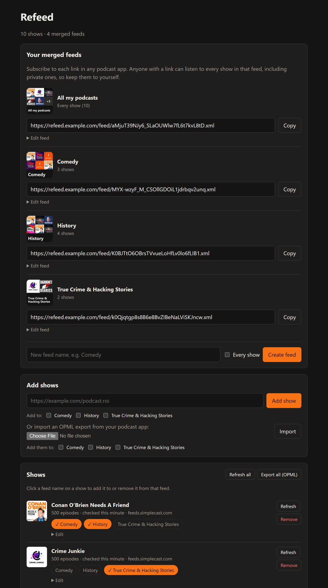

# podcast-rss-refeed

Merge your podcasts into **one RSS feed**, or several: an "everything" feed, a "Comedy" feed, a "History" feed. Subscribe to a single link in any podcast app and every show you put in it, public or private (Patreon, Supercast, ...), shows up there, newest first.

Self-hosted: one small Docker container with a web UI for managing your shows.

<p align="center">
  
</p>

## Why

Podcast apps lock your subscriptions inside the app. A single merged feed works in *any* app, on any device, and you only manage the list in one place. It's also handy for players that only take one feed, like smart speakers, car systems or simple RSS readers.

## Features

- **Multiple merged feeds**: put each show in as many feeds as you like with one click, or let a feed include every show automatically.
- **Automatic cover art**: each merged feed gets a collage of its shows' artwork with the feed's name in large type, designed to stay readable at podcast-app thumbnail size. It updates itself when shows change, or set your own image instead.
- **Web UI**: add shows by URL, import the OPML export from your current podcast app (straight into a feed), export OPML back out, per show or per feed.
- **Works in any podcast app**: episodes keep their original audio links and GUIDs, each episode carries its own show's artwork, and titles can be prefixed with the show name (`[Show] Episode`).
- **Per-show control**: cap how many episodes each show contributes, rename shows, pause them.
- **Private feeds stay private**: each merged feed lives at its own unguessable URL that you can rotate at any time, it's marked `itunes:block` and `noindex`, and source feed URLs (which often contain access tokens) are never logged.
- **Optional proxy per feed**: send specific feeds through an HTTP proxy, for example a VPN container. Useful for hosts like Patreon that block many datacenter IP addresses.
- **Polite fetching**: conditional requests (ETag / Last-Modified) on a schedule; everything is stored in SQLite.

## Quick start

You need Docker with the Compose plugin.

```bash
mkdir refeed && cd refeed
curl -fsSLO https://raw.githubusercontent.com/dustinreeves/podcast-rss-refeed/main/docker-compose.yml
curl -fsSL https://raw.githubusercontent.com/dustinreeves/podcast-rss-refeed/main/.env.example -o .env
# edit .env: set ADMIN_PASSWORD and BASE_URL
docker compose up -d
```

Open http://localhost:8080 and sign in as `admin` with your password. Add some shows or import your OPML, then subscribe to a link under **Your merged feeds** in your podcast app.

You start with one feed that includes every show. To split things up, create more feeds (say "Comedy" and "History"), then click a feed's name on each show to put it in or take it out. A show can be in any number of feeds.

To build from source instead, clone the repo and run `docker compose up -d --build`.

### Reaching it from your phone

Podcast apps need to reach the feed over the internet, so put the container behind a reverse proxy with HTTPS. With [Caddy](https://caddyserver.com/):

```
refeed.example.com {
	reverse_proxy 127.0.0.1:8080
}
```

Then set `BASE_URL=https://refeed.example.com` in `.env` and run `docker compose up -d` again.

> **Behind Cloudflare or another bot filter?** Many podcast apps (Overcast, Pocket Casts, Apple Podcasts, Spotify) fetch feeds from their own servers, not from your phone. A bot challenge such as Cloudflare's "Just a moment…" page will break the feed for them. Let `/feed/*` through without a challenge, for example with a WAF skip rule for that path.

## Configuration

Environment variables (see [`.env.example`](.env.example)):

| Variable | Default | Meaning |
| --- | --- | --- |
| `ADMIN_USER` | `admin` | Web UI username |
| `ADMIN_PASSWORD` | *(empty)* | Web UI password. If empty, the UI is open to anyone who can reach it. |
| `BASE_URL` | request host | Public address, e.g. `https://refeed.example.com`, used to build the feed link |
| `REFRESH_MINUTES` | `30` | How often every show is checked for new episodes |
| `FETCH_PROXY` | *(empty)* | HTTP proxy for feeds marked "Fetch through proxy", e.g. `http://gluetun:8888` |
| `DATA_DIR` | `/data` | Where the database, cached artwork and covers live (the `refeed-data` volume) |
| `COVER_FONT` | DejaVu Sans Bold | Path to a `.ttf` font for the generated cover titles |

Each feed's title, description, cover art and episode limit, plus the default episodes per show, are set in the web UI.

### Fetching some feeds through a VPN

Some private feed hosts refuse requests from datacenter IP addresses. Run a VPN container with an HTTP proxy next to refeed, such as [gluetun](https://github.com/qdm12/gluetun), point `FETCH_PROXY` at it, and tick **Fetch through proxy** on those feeds. Example `docker-compose.override.yml`:

```yaml
services:
  gluetun:
    image: qmcgaw/gluetun
    cap_add: [NET_ADMIN]
    devices: [/dev/net/tun:/dev/net/tun]
    environment:
      - HTTPPROXY=on
      # plus your VPN provider settings, see the gluetun wiki
    restart: unless-stopped
  refeed:
    environment:
      - FETCH_PROXY=http://gluetun:8888
```

Only refeed's feed requests use the proxy. Your podcast app still downloads the audio itself.

## Updating and backups

```bash
docker compose pull && docker compose up -d
```

Everything (shows, cached episodes, feeds and their links, artwork) is in the `refeed-data` volume. To back it up:

```bash
docker compose exec refeed python -c "import sqlite3; sqlite3.connect('/data/refeed.db').backup(sqlite3.connect('/data/backup.db'))"
docker compose cp refeed:/data/backup.db ./refeed-backup.db
```

You can also keep an OPML export from the web UI as a lightweight backup of your show list.

## Security notes

- Anyone with a merged feed link can listen to everything in that feed, including paid shows. Treat it like a password. **New link** in the UI makes the old one stop working. The generated cover is served at a URL with the same secret.
- The web UI uses HTTP Basic auth, so only expose it over HTTPS.
- Audio is not proxied or re-hosted. Podcast apps download episodes straight from each show's host, as they normally would, so the shows still see their downloads.
- This is for your own listening. Please don't use it to republish other people's podcasts, and never share a merged feed that contains paid content.

## Development

```bash
python -m venv .venv
.venv/bin/pip install -r requirements.txt pytest
.venv/bin/pytest
DATA_DIR=./data .venv/bin/uvicorn app.main:app --reload --port 8080
```

The app is FastAPI with Jinja templates and SQLite, in [`app/`](app):

| File | What it does |
| --- | --- |
| `main.py` | Routes: web UI, merged feed endpoint, auth |
| `fetcher.py` | Fetches and parses source feeds on a schedule |
| `builder.py` | Builds the merged RSS XML |
| `cover.py` | Generates cover art collages with Pillow |
| `db.py` | SQLite schema and queries |
| `opml.py` | OPML import and export |

## License

[MIT](LICENSE)
